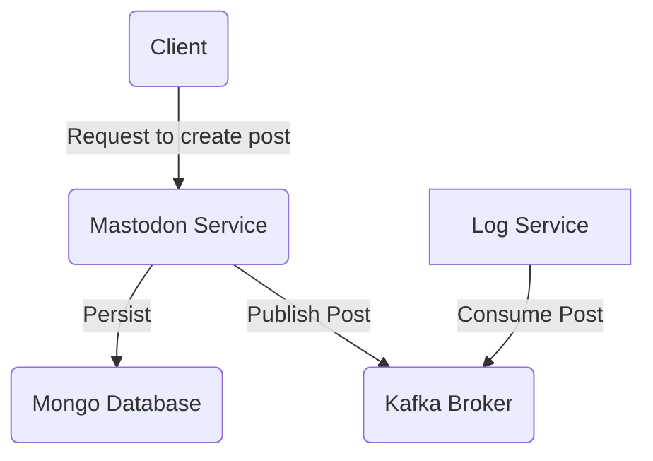

# Coop Test

<!--toc:start-->

- [Coop Test](#coop-test)
  - [Architecture](#architecture)
    - [System flowchart](#system-flowchart)
  - [Prerequisites](#prerequisites)
  - [How to test the application](#how-to-test-the-application)
  <!--toc:end-->

This application was made with Go as the programming language, Docker as the
container solution, and GitHub Actions as the CI/CD provider.

## Architecture

This is a system consisting of multiple isolated solutions communicating with
each other. The following is an overview of the system.

- Mastodon Service which handles posts created by users
- Log Service which consumes and logs posts published by the Mastodon service
- Apache Kafka which serves as an event broker
- Mongo Database which serves as the persistence solution for the Mastodon service

### System flowchart



## Prerequisites

- [Docker](https://docs.docker.com/engine/install/) and [Docker Compose](https://docs.docker.com/compose/install/) is required to run this application. If you have
  installed Docker Desktop, you should have them both.
- [Curl](https://curl.se/download.html) is useful for testing the system from the comfort of your terminal.
  If you're unable to use curl, you can use any application that lets you
  send HTTP requests, like Postman or Insomnia.

## How to test the application

To run the application, open the root folder of the project in a terminal and
run `docker compose up`. You will see log output from all the docker containers
in the terminal window where you ran the command. When the logs slow down, the
application should be ready to be tested.

The following steps will demonstrate that a request with a new post to the
mastodon service will result in the post being logged by the log service.

1. Keep the terminal window where you ran `docker compose up` visible
2. Open a new terminal window and run the following command:

   ```shell
   curl -X POST \
   http://localhost:8081/posts \
   -H "Content-Type: application/json" \
   -d '{"title":"A Day in the Life at Coop","body":"I started the day with..."}'
   ```

3. Notice that the log service almost immediately prints information about the post.
   To get a more focused view of the logs, you can open a new terminal window
   and run the command: `docker compose logs -f log`
4. The posts are also stored in a Mongo database by the mastodon service.
   Run the following command in a terminal window to list all the events:

   ```Shell
   curl http://localhost:8081/posts
   ```
